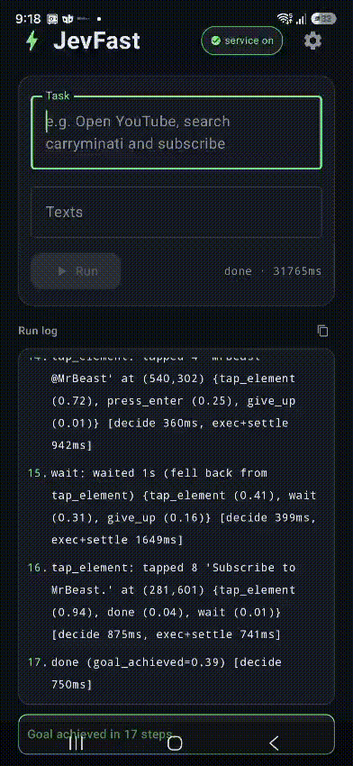
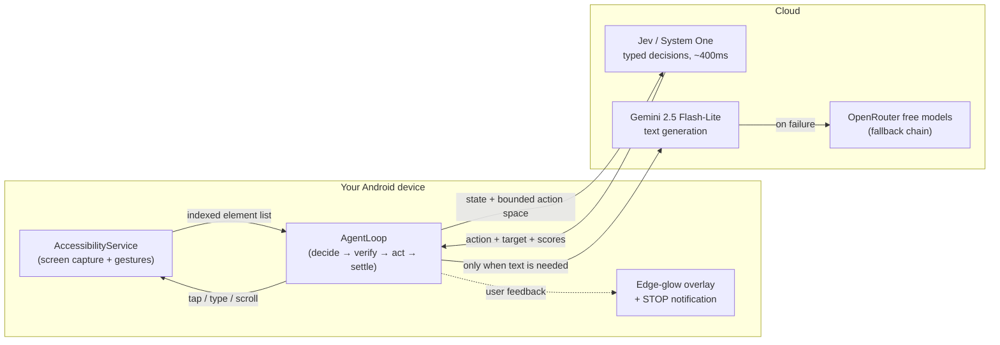

<div align="center">

# Jev Android Super

**An AI agent that drives your Android phone — fast.**

Tell it what you want in plain English. It reads the screen, decides the next
tap in a fraction of a second, and keeps going until the job is done.

[](https://www.android.com)
[](https://kotlinlang.org)
[-0A7FFF)](https://typesafe.ai/blog/introducing-system-one-models-and-jev)
[](LICENSE)

### [⬇ Download the APK — jev-android-super.apk](https://github.com/SomeshSampat2/jev-android-super/releases/latest/download/jev-android-super.apk)



*Goal: "open YouTube and subscribe to MrBeast" — 17 steps, ~32 s, fully autonomous.*

</div>

---

## What is this, in plain words?

Phones today are controlled by *your* fingers. Jev Android Super hands that
control to an AI for a single task you define.

You type something like:

> *"Open the Play Store, search for YouTube, and install it"*
> *"Open YouTube, find MrBeast's channel and subscribe"*
> *"Open Google Maps and search for coffee shops near me"*

The app then **looks at your screen the same way Android's accessibility
features do** — a structured list of buttons, text fields, and labels — and
asks a very fast decision model *"given this goal and this screen, what is the
single best next action?"* It performs that action with real taps, swipes and
typing, watches the result, and repeats until the goal is visibly complete.

A blue glowing border appears around the screen whenever the agent is in
control, and a silent notification with a **STOP** button lives in your
notification shade — you can end a run at any moment.

## Why is it fast?

Most phone agents send a giant screenshot or page dump to a big language model
and wait seconds for a full paragraph of reasoning — for *every single tap*.

This project splits the work:

| Job | Who does it | Why |
|-----|-------------|-----|
| **Decisions** — *"what action, on which element?"* | **Jev** ([TypeSafe System One](https://typesafe.ai/blog/introducing-system-one-models-and-jev)) | Returns a typed judgment + probabilities in ~400 ms. No essays, no parsing fragile prose. |
| **Launch** — *"which app does the goal need?"* | **Gemini 2.5 Flash-Lite** structured pick | One fuzzy goal→app match at run start — no hunting icons on the launcher. Falls back to the Play Store when the app isn't installed. |
| **Words** — *"what text should go in this field?"* | **Gemini 2.5 Flash-Lite** → free [OpenRouter](https://openrouter.ai) models | Only called when free-form text is genuinely needed. Thinking disabled for lowest latency. |
| **Hands** — *tap / type / scroll / back / home* | Android **AccessibilityService** | Deterministic execution, no flakiness. |
| **Eyes** — *what is on screen right now?* | Accessibility node tree | Every interactive element is indexed with its label, bounds and state. |

One request to Jev asks **all** questions in parallel — goal reached? which
action? which tap target? which text field? would navigating away lose
progress? — so a step costs a single ~400 ms round trip instead of several.

## Architecture



### Inside the agent loop

0. **Launch** — Gemini picks the app the goal needs from the installed list
   (one structured-output call) and the app is opened directly by intent.
   If the goal needs something not installed, the Play Store opens and Jev
   drives the install flow. No Gemini key? The loop simply navigates itself.
1. **Capture** — the accessibility service reads the live UI tree; every
   interactive element gets an index, label, type, bounds and state flags
   (`editable`, `scrollable`, `typed`, …).
2. **Guard** — loading screens, empty trees and mid-transition frames are
   waited out; screens already visited get "try something different" hints.
3. **Decide** — Jev receives the goal, the indexed elements, recent actions and
   a *bounded* action space (scroll is only offered if something scrollable
   exists, enter only if a field is editable). It returns probabilities for
   every choice in **one** request.
4. **Verify** — code-side checks run before anything executes: paywall/purchase
   controls are refused unless the goal asks, `go_home`/`go_back` are vetoed
   when Jev itself predicts progress loss, typed fields can't be re-typed,
   tap coordinates are re-resolved against the live screen.
5. **Act** — deterministic `dispatchGesture` taps and `ACTION_SET_TEXT`.
6. **Settle & repeat** — wait for the screen to stabilize (extra patience when
   the node tree collapses mid-render), detect "nothing changed",
   repeat-until-done. Loop detectors (repeats, cycles up to period 8, screen
   revisits) stop runaway behavior — and per-screen **undo suppression**
   removes taps proven to navigate backward, breaking A→B→A ping-pongs the
   cycle detector can't see.

## Safety by design

- **You stay in charge** — a persistent notification with **STOP** ends any run;
  the glowing border makes "AI is driving" unmistakable.
- **No accidental purchases** — controls like *Buy / Join membership / Pay now*
  are blocked unless your goal explicitly asks for them.
- **Loop-proof** — repeat, cycle and screen-revisit detectors halt stuck runs
  instead of burning steps forever.
- **Screen stays awake** while the agent works; overlay is non-touchable so it
  never interferes with real UI.
- **Keys stay local** — API keys live in `local.properties` / on-device storage
  only and are never uploaded.

## Setup

1. **Get the app** — [download the APK](https://github.com/SomeshSampat2/jev-android-super/releases/latest/download/jev-android-super.apk)
   and install it, or build from source below.
2. **Add your keys** — open the app → *Settings*:
   - **TypeSafe API key** — required, powers Jev decisions
     ([typesafe.ai](https://typesafe.ai)).
   - **Gemini API key** — recommended, powers fast text entry and the
     run-start app pick
     ([aistudio.google.com/apikey](https://aistudio.google.com/apikey)).
   - **OpenRouter API key** — optional fallback for text
     ([openrouter.ai](https://openrouter.ai)).
3. **Enable the accessibility service** — the app banner links straight to
   *Settings → Accessibility → Jev Android Super*.
4. Type a goal, press **Run**, watch the glow.

### Build from source

```bash
git clone https://github.com/SomeshSampat2/jev-android-super.git
cd jev-android-super

# local.properties (gitignored) — keys baked into BuildConfig at build time:
#   sdk.dir=/path/to/Android/sdk
#   TYPESAFE_API_KEY=...
#   GEMINI_API_KEY=...
#   OPENROUTER_API_KEY=...

./gradlew assembleDebug
adb install -r app/build/outputs/apk/debug/app-debug.apk
```

Requires **Android 8.0 (API 26)+**, JDK 17, Android SDK 36.

## Tech stack

`Kotlin` · `Jetpack Compose` + Material 3 · `AccessibilityService` +
`dispatchGesture` · `Retrofit` + `OkHttp` + `kotlinx.serialization` ·
Coroutines / StateFlow · TypeSafe **Jev** REST API · Gemini `generateContent`
REST API · OpenRouter chat-completions API

## Inspiration & references

- [Introducing System One models and Jev](https://typesafe.ai/blog/introducing-system-one-models-and-jev) — TypeSafe
- [jev-ultrafast](https://github.com/browser-use/jev-ultrafast) — Browser Use: dynamic action space, per-op target heads
- [Svate](https://github.com/JIEAO-re/Svate) — observe → plan → safety → execute → verify, for mobile
- [Gemini API docs](https://ai.google.dev/gemini-api/docs/models/gemini-2.5-flash-lite) · [OpenRouter](https://openrouter.ai/models?variant=free)

## License

[MIT](LICENSE) — use it, fork it, build on it.
